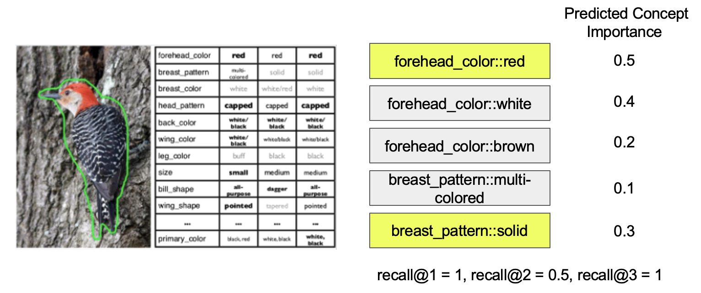
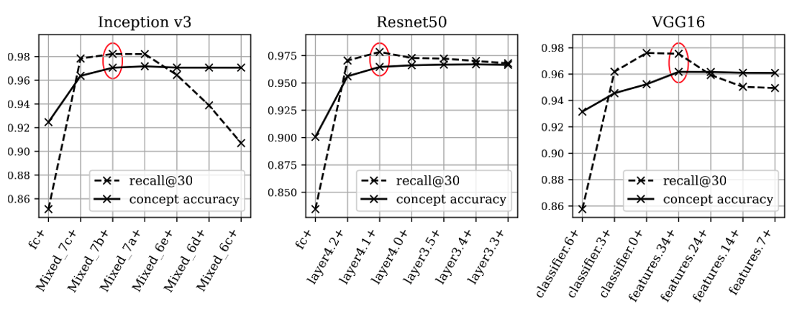
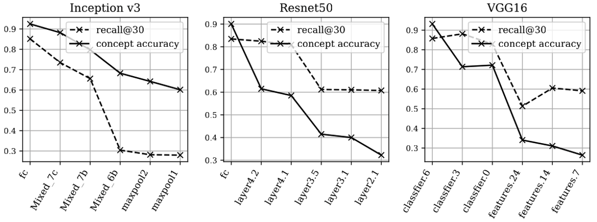
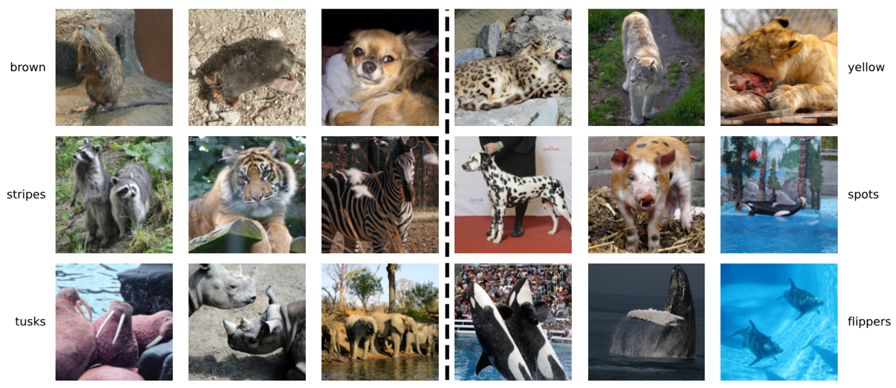

> Concept-based interpretations of black-box models are often more intuitive for humans to understand. The most widely adopted approach for concept-based interpretation is Concept Activation Vector (CAV). CAV relies on learning a linear relation between some latent representation of a given model and concepts. The linear separability is usually implicitly assumed but does not hold true in general. In this project, we extending concept-based interpretation to non-linear concept functions with Concept Gradients (CG). We showed that gradient-based interpretation can be adapted to the concept space. We demonstrated empirically that CG outperforms CAV in both toy examples and real world datasets.

<!--more-->
{: class="table-of-content"}

* TOC
{:toc}
# Rethinking concept-based interpretation with gradients

> tl;dr: Extend concept-based attribution with CAV to non-linear concept functions.

## Preliminaries

### Motivation

Interpretation is important for ML systems IRL and concept-based intepretations are easier for humans to understand, achieving the goal of interpretation. TCAV [1] is a SOTA method for concept-based interpretation and is widely adopted for its simplicity and effectiveness. TCAV calculates the alignment of gradients and approximates the concept with a linear function. There are two problems we are attempting to answer. First, TCAV relies on the linear separability assumption which may not hold in general. What happens in that situation does the method still work? Second, there is a line of work of feature attribution based on calculating input gradients. TCAV also uses gradients in its calculation. How does TCAV relate to other gradient-based attribution methods? Our goal is to better understand how TCAV mathematically works and improve on its flaws.

### Expected results

We aim to show (1) how TCAV behaves when concepts are not linearly separable in any model layer and (2) whether interpretations with TCAV is consistent when concepts are linearly separable in many layers. We also aim to mathematically show the connections between TCAV score and the gradient of the model output with respect to concepts. 

### Project timeline

1. Week 4-5: experiment with TCAV on artificially constructed models to examine its interpretations when concepts are not linearly separable.
2. Week 6-7: analyze TCAV mathematically to obtain theoretical insights of how the method works and its limits induced by its implicit assumptions.
3. Week 8-9: propose improved version of TCAV based on the theoretical insights (week 6-7) that solved the empirically shown problems (week 4-5).
4. Week 10: wrap up, present, and compose report.

### Datasets

* [Benchmarking Attribution Methods (BAM)](https://github.com/google-research-datasets/bam): an artificial dataset where the objects from MSCOCO are pasted onto MiniPlaces background scenes. Classifiers trained on the dataset with different ground truth labels are expected to attribute concepts accordingly. For instance, an object classifier should only attribute importance to object concepts and none to scene concepts.
* [Broad and Densely Labeled Dataset (Broden)](https://continental.github.io/hybrid_learning/docs/apiref/generated/hybrid_learning.datasets.custom.broden.html): combination of multiple image datasets with fine-grained semantic labels that can serve as ground truth for concepts if we consider semantic labels as concepts.
* [CUB-200-2011](http://www.vision.caltech.edu/datasets/cub_200_2011/): a dataset for fine-grained bird image classification. It consists of 11k bird images, 200 bird classes, and 312 binary bird attributes. These attributes are descriptors of bird parts (e.g. bill shape, breast pattern, eye color) that can be used for classification.
*  [Animals with Attributes 2 (AwA2)](https://cvml.ist.ac.at/AwA2/): an image classification dataset with 37k animal images, 50 animal classes, and 85 binary attributes for each class. These concepts cover a wide range of semantics, from low level colors and textures, to high level abstract descriptions (e.g. “smart”, “domestic”). 

## Project summary

### Methodology

#### Notation

We denote the input space as $\mathcal{X}$, label space as $\mathcal{Y}$, and concept space as $\mathcal{C}$. Let us consider a target function $f:\mathcal{X} \rightarrow \mathcal{Y}$ and concept function $g: \mathcal{X} \rightarrow \mathcal{C}$.

#### CAV concept saliency

Given $x \in \mathcal{X}$, Kim et al. [1] defines a concept activation vector (CAV) of a concept function $g$ by first approximating $g$ with a linear function $\hat{g}(x) = \hat{w}^Tx+\hat{b}$
$$
\hat{w}, \hat{b} := {\arg\min}_{w, b} \mathbb{E}_{x\in\mathcal{X}} [L\big( w^Tx + b, g(x) \big)]
$$
where $L$ is the loss function of choice. $\hat{w}$ is the concept activation vector (CAV) and represents the concept in the input space $\mathcal{X}$.

CAV concept saliency is then defined as follows
$$
S_{f,g}(x) 
= \langle \nabla f(x), \frac{\nabla \hat{g}(x)}{\|\nabla \hat{g}(x)\|}\rangle 
= \langle \nabla f(x), \frac{\hat{w}}{\|\hat{w}\|} \rangle
$$
CAV concept saliency aims to capture the sensitivity of the target function output in the direction of a given CAV. Higher $S_{f,g}$ implies moving towards the CAV direction in the input space increases the target output more, implying more concept relevance.

#### Concept gradients

We define the **Concept Gradient (CG)** to measure how small perturbations on each concept affects the label prediction:
$$
\text{CG}(x) := \nabla f(x) \nabla g(x)^\dagger
$$
We show that CAV concept saliency is a special case of CG. Let us consider $g$ restricted to linear functions, as assumed in the CAV case.
$$
g(x) = w^Tx + b
$$
We can then derive the CAV concept saliency from CG
$$
\text{CG}(x) = \nabla f(x) \nabla g(x)^\dagger = \nabla f(x) (w^T)^\dagger
= \nabla f(x) \cdot \frac{w}{\|w\|^2} = \frac{S_{f,g}(x)}{\|w\|}
$$
Thus, we conclude that CAV is a special case of CG (normalized by the gradient norm). Furthermore, CG is better than CAV concept saliency when **concepts cannot be represented by linear functions**.

### Experiment results

We started out with a synthetic example to demonstrate that the linear separability assumption does not hold even in simple cases and CG is superior to CAV. We then benchmarked CG on real world datasets with ground-truth concept labels to show that CG outperforms CAV in accurately attributing concept importance and show some qualitative results.

#### Synthetic example

The purpose of this example is to test whether TCAV and CG can recover the actual gradient in a synthetic scenario where the derivative of target y with respect to concept c uniquely exist and can be expressed in closed-form. Theoretically, we have shown CG is capable of exactly recovering the derivative via chain rule. On the other hand, CAV can only retrieve the gradient attribution if the concepts are linearly separable in some input latent representation. We find that the linear separability assumption doesn’t hold even in such simple scenarios.

The concepts are visualized in Fig. 1 below. Observe that the sine functions are unable to be approximated linearly well.

<figcaption>Fig.1 - Visualization of concepts.</figcaption>

##### Training

First, we trained a 4-hidden-layer, fully-connected neural network model $f$ that maps $(x_0, x_1)$ to $y$. This serves as the target model to be interpreted. For CAV, we calculate the CAVs  corresponding to the two concepts $(c_0, c_1)$ in the first 3 hidden layers. Note that the last hidden ayer cannot be used to calculate CAV otherwise the concept saliency score $S_{f,g}$ would degenerate to a constant for all input $(x_0, x_1)$. For CG, we trained two 4-hidden-layer, fully-connected neural network models $g_0, g_1$ that maps $(x_0, x_1)$ to $c_0$ and $c_1$, respectively.

##### Evaluation

Fig. 2 visualizes the concept prediction results with CAV and CG. Here we fixed one the input variables ($x_0$ or $x_1$) to a constant value and show the relation between the remaining input variable and the predicted concepts. CG captures the concept relation significantly better than the linear functions of CAV (for all layers). CG concept predictions are almost identical to the ground truth. 

<figcaption>Fig.2 - Synthetic experiment prediction results.</figcaption>

Next we compare the concept importance attribution between CAV and CG. For CAV, we calculate the concept saliency $S_{f,g}$ as concept importance. For CG, we calculate the concept gradient via chain rule. Recall the ground truth importance attribution for y is $\alpha_0, \alpha_1$ for $c_0, c_1$ respectively, constant for every input sample. The mean square error for the predicted concept importance is shown in Fig. 3. The error of CG is an order less than even the best of the CAVs. Thus, we have shown that CG is capable of capturing the concept relation better, which leads to more accurate gradient estimation and outperforming CAV in concept importance attribution.

<figcaption>Fig.3 - Synthetic experiment concept importance estimation errors.</figcaption>

#### Quantitative analysis

In this experiment, our goal is to quantitatively benchmark how well CG is capable of correctly241
retrieving relevant concepts in a setting where the ground truth concept importance is available.

##### Dataset

We conducted the experiment on the CUB-200-2011 dataset. We followed experimental setting and preprocessing in [2] where class-wise attributed labels are derived from instance-wise attribute labels via majority vote

<figcaption>Fig.4 - A sample from the CUB dataset.</figcaption>

##### Training

We first trained models to predict the class labels as the target model $f$ . We then finetuned $f$ to predict concepts labels, freezing some model weights, to serve as the concept model $g$. The study is conducted on three CNN architectures: Inception v3, Resnet50, and VGG16. We performed extensive study on how finetuning different portions of the model as well as which layer is used for evaluating concept gradient affect CG’s importance attribution. We also performed trained CAVs on different model layers as baselines for comparison. The layer for evaluating CG or CAV defaults to the previous layer of finetuning, unless specified otherwise.

##### Evaluation

We evaluate the performance of concept importance attribution by measuring the concept recall. Specifically, we treat concept prediction as a multilabel classification problem. For an input instances, there are multiple concepts with positive labels. A good importance attribution method should assign highest concept importance to concepts associated with positive labels. We rank the concepts according to their attributed importance and take the top k to calculate recall@k. Higher recall implies better alignment between predicted and ground truth concept importance.

###### Analysis on CG

For CG, we experimented with finetuning with different portions of the model weights frozen. We plotted the CG concept recalls in Fig. 5. The plus sign in x-axis implies all layers after the specified layer are also finetuned. For reference, we also plotted the concept prediction accuracy. The first thing we notice is that as the number of finetuned layers increases, the concept validation accuracy increases until some layer, then plateaus. The mutual information between the representation of $\mathcal{X}$ and the concept $\mathcal{C}$ gradually reduces in deeper layers. Therefore as more layers are unfrozen and finetuned, more information can be used to predict concepts. The optimal recall occurs when the concept accuracy plateaus.

<figcaption>Fig.5 - CG concept recall and concept prediction accuracy for different finetuned layers and model architectures on CUB (left to right, deep to shallow layers). The optimal recall generally occurs when concept accuracy plateaus (circled).</figcaption>

###### Analysis on CAV

For CAV, we experimented with different layers of the model. We plotted the CAV concept recalls in Fig. 6. Similar to the CG results, the concept accuracy are provided for reference to show how well the CAVs capture the concepts. We observe that the CAVs in later layers perform better in both recall and concept accuracy. The trend is generally monotonic. The accuracy never saturates since linear functions are insufficient to predict the concepts, even for the final layer where the concept is closest to being linearly separable in the representation of x. 

CAV is equivalent to CG in the final layer since the final layer is a linear layer. Interestingly, the result is the best for CAV, but the worst for CG in the final layer. This is also verified in Fig. 5 and Fig. 6, where the worst result of CG matches the best result of CAV at the final layer. Therefore, the performance of CG dominates that of CAV’s.

<figcaption>Fig.6 - CAV concept recall and prediction accuracy for different selected layers and model
architectures on CUB (left to right, deep to shallow layers). The optimal recall occurs when finetuning
the final layer which coincides with the highest concept accuracy. Performing CAV in the final layer
is equivalent to CG, so best CAV recall in this figure corresponds to the worst CG recall in Fig. 5.</figcaption>

#### Qualatative analysis

The purpose of this experiment is to provide intuition and serve as a sanity check by visualizing instances and how CG attributes concept importance.

##### Dataset

We conducted the experiment on the Animals with Attributes 2 (AwA2). We further filtered out 60 concepts that is visible in the input images to perform interpretation.

##### Training

The training is identical to the quantitative experiments.

##### Evaluation

The evaluation is performed on the validation set. Fig. 7 visualizes the instances with the highest CG importance attribution for 6 selected concepts, filtering out samples from the same class (top 1 instance in the top 3 classes). The concepts are selected to represent different levels of semantics. The top row contains colors (low-level), the middle row contains textures (medium-level), and the bottom row contains body components (high-level). Observe that CG is capable of handling different levels of semantics simultaneously well, owing to the expressiveness of non-linear concept model $g$. 

<figcaption>Fig.7 - Visualization of instances with highest CG attributed importance (AwA2 validation set) for each concept (top 1 instance in the top 3 classes per concept). CG is capable of handling low level
(colors), middle level (textures), and high level (body components) concepts simultaneously.</figcaption>

### Conclusion

1. Extend concept-based attribution to non-linear concept functions via CG
2. Insight: derivative via chain rule through input X
3. Understand success of TCAV: CAV is special case of CG
4. Proposed guideline for optimal layer selection

### Future directions

1. Beyond natural image tasks (e.g. text, biomed)
2. Drop dependence on representation of input $\mathcal{X}$
3. Connect with plethora of gradient-based feature attribution methods (e.g. Smooth-Grad, Integrated Gradients, DeepLIFT, LIME)

## Reference

[1] Kim, Been, et al. "Interpretability beyond feature attribution: Quantitative testing with concept activation vectors (tcav)." *International conference on machine learning*. PMLR, 2018.

[2] Koh, Pang Wei, et al. "Concept bottleneck models." *International Conference on Machine Learning*. PMLR, 2020.

---
